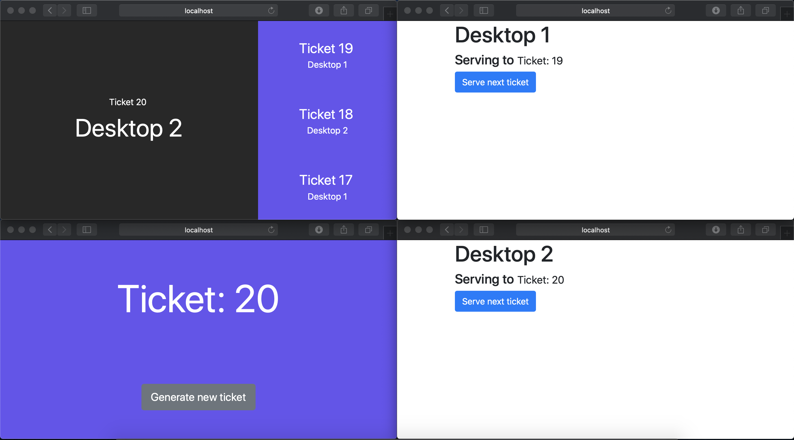

# Bank Tail System with Socket.io + Node.js 

### Features

- The app has multiview system (bank cashier, tickets machine and information display) 
- The app works with two-way communication between client and server (sockets.io)
- When a customer is called through the desktop, the information screen plays a sound
- Routing with ExpressJS

This app is a test, feel free to explore the entire code

### How to use

To try the web-app, you need initialize the project using `npm install` command.